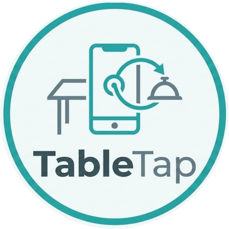

# 🛎️ TableTap: The Hybrid Hospitality Suite

<p align="center">
  
</p>

> There is a fine line between a "patient customer" and a "forgotten table," and it usually involves trying to flag someone down for a simple glass of water. Why wait for a gap in the chaos? TableTap brings the menu to your fingertips, allowing you to customize your order and follow its progress live. It’s sophisticated, quiet, and incredibly efficient.

TableTap is a comprehensive ecosystem designed to bridge the communication gap in high-traffic dining environments. It consists of three tightly integrated sub-modules that work in perfect harmony to deliver a premium dining experience.

---

## 🛠️ Project Architecture

TableTap is structured as a mono-repo for ease of development, though each component is a standalone service:

1.  **[Core Server](./server)**: The real-time synchronization engine (Node.js/Socket.io).
2.  **[Customer App](./customer)**: The premium mobile-web interface for diners (Next.js).
3.  **[Staff Platform](./staff)**: The command center for kitchen, waiters, and management (Next.js).

---

## 🚀 Getting Everything Running

To test the full loop locally, follow these steps in order:

### 1. Clone & Setup
```bash
git clone --recursive git@github.com:kakaAllord/tableTap.git
cd tableTap
```
**[OR]**
```bash
git clone git@github.com:kakaAllord/tableTap.git
cd tableTap
git submodule update --init --recursive
```


### 2. Start the Engine (Server)
```bash
cd server
npm install
npm run start:dev
```
*Server runs on port **3001***.

### 3. Launch Customer Experience
In a new terminal:
```bash
cd customer
npm install
npm run dev
```
*Accessible at [http://localhost:3000](http://localhost:3000)*.

### 4. Open Staff Portal
In a new terminal:
```bash
cd staff
npm install
npm run dev -- -p 3002
```
*Accessible at [http://localhost:3002](http://localhost:3002)*.

---

## 🤝 Contribution Guide

Built by devs, for devs. TableTap is an open-source project designed to be extended and improved. If you have ideas for better logic, smoother animations, or new payment gateways, we welcome your input!

1.  **Fork** the repository to your own account.
2.  **Clone** your fork and create a new feature branch: `git checkout -b feature/amazing-logic`.
3.  **Commit** your changes with clear messages.
4.  **Push** to your fork.
5.  **Create a Pull Request** describing your improvements.

---

## 💎 Live Testing
Place an order now and monitor the waiter's side to see the hybrid payment and notification engine in action.

🔗 **[Customer Experience](https://table-tap-customer.vercel.app/)**  
🔗 **[Staff Platform](https://table-tap-staff.vercel.app/)**

---

### **Created with ❤️ by [Allord Archard](https://github.com/kakaAllord)**
*Refining the art of hospitality through code.*